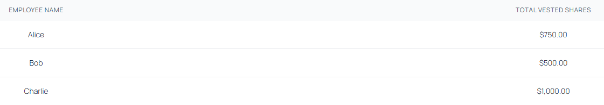

# vestedshares

Project consists of two modules:

## Frontend
Frontend part is built with react framework, contains a single page with one table displaying results from the api GET call.
Potential extensions:
- DONE: extract fetch method to separate service, not in the App file
- DONE: extract table to separate component
- DONE: extract row entry to reusable component that could be used accross numerous other tables
- make row and table components more generic
- consider introducing axios approach instead of fetch
- introduce authentication to the server call
- play with build options (for example add lint)
- error handling for failed promises

## Backend
Backend api contains a single endpoint that returns content of the hardcoded JSON. This content is grouped and numbers are summed up as required.
Potential extensions:
- introduce authentication
- extend the project with database instead of sample json and build DB repository
- extend the api with error handling
- play with the structure of the project to extract the routing
- introduce zod validation

## Some pre dev comments
While following steps from instruction I came across couple gotchas:
- during installation of packages I have to take care of Execution Policy settings in Powershell
- it looks as if there were some changes in package names since the instruction was created, I was not able to install npm:@tailwindcss/vitedeno, had to go with npm:@tailwindcss/vite instead
- had to ramp up on Hono a little, bit, this one was interesting read https://hono.dev/docs/api/context
- had to take care of CORS

